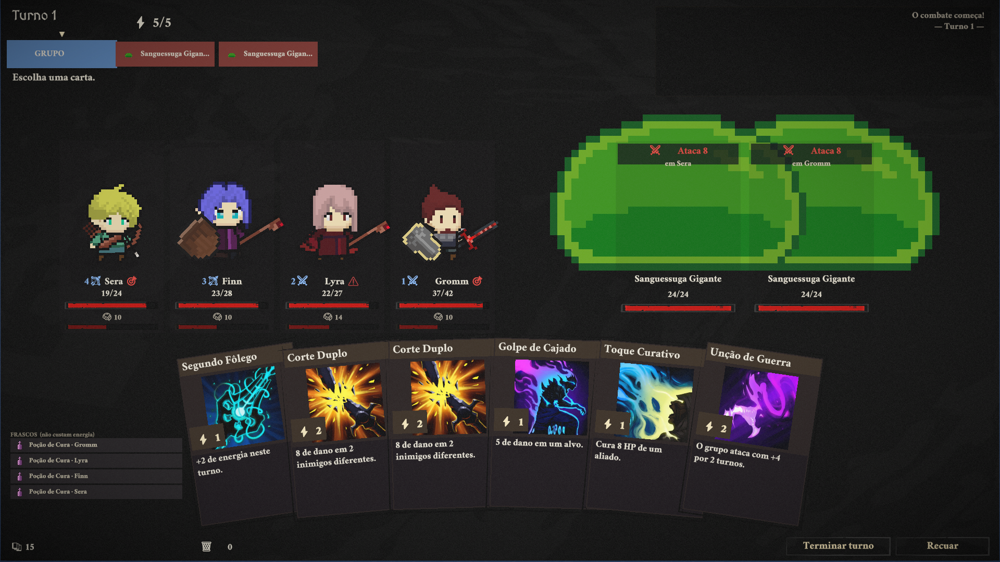

# Guilda da Corrupção

Roguelike de gerência de guilda com combate por cartas — uma mistura de *Darkest Dungeon*
com *Slay the Spire*. Você não controla o herói: você decide **quem** arrisca a vida, **com
qual baralho** e **até onde** vale a pena ir.

**Unity 2022.3.62f3 · URP · C# · PC**

> Combate em execução: os inimigos anunciam a intenção do turno, cada herói mostra vida,
> estresse e bloqueio, e as cartas exibem custo de energia, bônus de forja e penalidade de
> formação.

---

## O jogo

Você é o mestre da última guilda de um reino sendo devorado pela **Corrupção**. Recruta
heróis, monta os baralhos deles e envia expedições por sete biomas — floresta, montanha,
pântano, deserto, tundra, vulcão e ruínas. Cada bioma tem seu próprio nível de corrupção,
que define dificuldade, eventos e recompensas.

Heróis morrem **permanentemente**. A guilda vai cair mais cedo ou mais tarde; a questão é
quão longe você chega antes disso, e quanto da progressão você carrega para a próxima
tentativa.

### Os três pilares

| Pilar | O que significa em jogo |
|---|---|
| **Decisões com peso permanente** | Morte permanente; cada escolha custa alguém ou alguma coisa. |
| **Preparação > execução** | A partida é vencida na guilda — recrutamento e deckbuilding —, não só na luta. |
| **A Corrupção como relógio** | Uma pressão crescente que fecha regiões seguras e empurra o jogador para o perigo. |

## Estado atual

Protótipo jogável, com a jornada completa funcionando de ponta a ponta: seleção de grupo →
mapa ramificado → eventos e combates → vitória ou derrota → retorno à guilda.

| Sistema | Estado |
|---|---|
| Combate por cartas (energia, bloqueio, intenções do inimigo, estresse) | funcionando |
| Jornada com mapa ramificado, eventos e nós de descanso/tesouro | funcionando |
| Guilda: recrutamento, forja, mercado, biblioteca, cemitério | funcionando |
| Formação de grupo e efeitos de posição | funcionando |
| Deckbuilding por herói | funcionando |
| Meta-progressão entre partidas | parcial |
| Arte e áudio | placeholder |

## Como rodar

1. Abra a pasta do projeto no **Unity 2022.3.62f3**.
2. Carregue a cena inicial em `Assets/Scenes`.
3. Play.

## Testes

O projeto tem verificação automatizada em vez de teste só no olho:

- **Smoke test** (`GuildSmokeTest`) — 38 verificações que percorrem a jornada inteira e
  falham se qualquer tela, transição ou sistema quebrar.
- **Simulador de combate** — roda partidas em lote seguindo as regras reais do
  `CombatManager` (mão de cinco cartas, compra, bloqueio dos dois lados, as quatro intenções
  de inimigo, estresse e formação) para medir o balanceamento.

O simulador existe porque a primeira versão media errado: ela escolhia livremente a melhor
carta do baralho inteiro a cada turno e ignorava metade das regras, o que dava 100% de
vitória e escondia a dificuldade real. Reescrito para seguir o combate de verdade, o mesmo
conteúdo mediu **24% de vitória contra chefes, com 3,37 mortes por combate**.

## Documentação

- [`GDD.md`](GDD.md) — documento de design completo, com status por sistema
  (`[IMPLEMENTADO]` / `[PARCIAL]` / `[PLANEJADO]`).
- [`HANDOFF.md`](HANDOFF.md) — estado da última sessão de trabalho e próximos passos.

## Notas

- O nome é provisório. O projeto também aparece como *Guild of Legends* na documentação
  mais recente.
- Os relatórios `PlayModeReport*.txt` são gerados a cada sessão de teste e ficam fora do
  versionamento.
